<div align="center">
  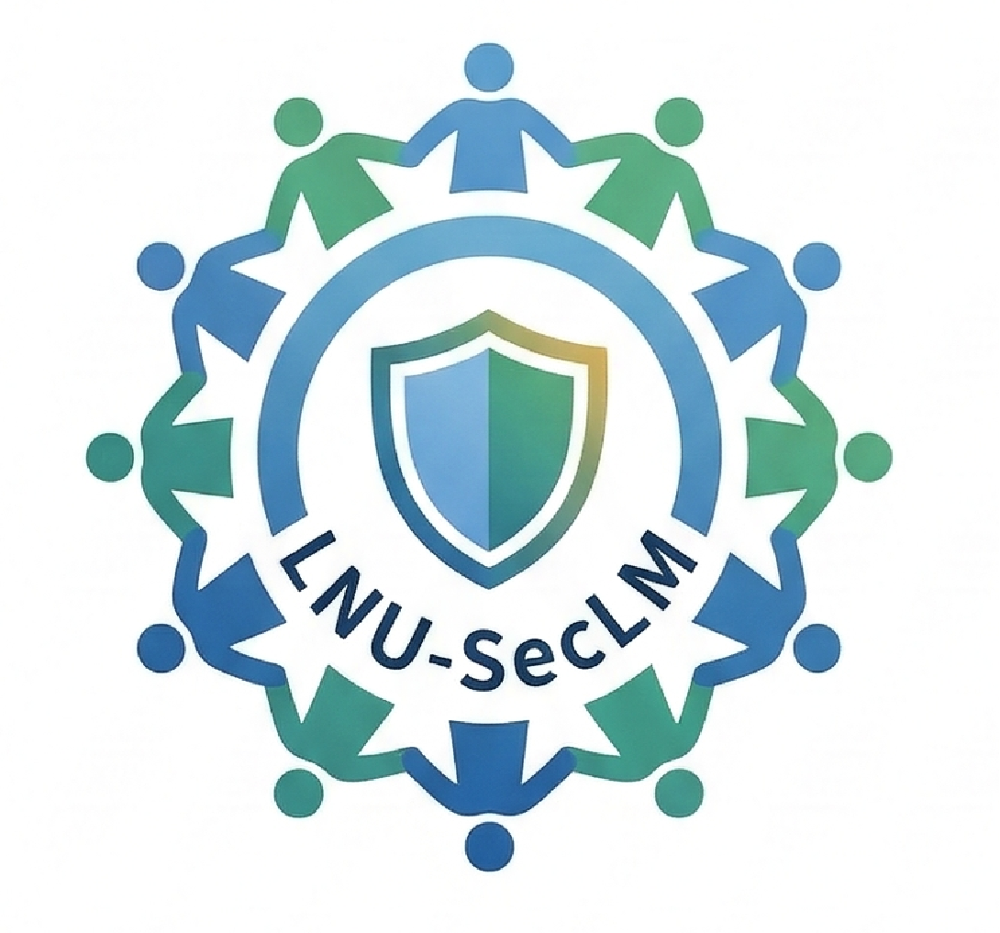
</div>

# LNU-SecLM

[中文](README_CN.md) | [English](README.md)

> **辽宁大学校园开源安全社区平台** —— AI 驱动的安全工作台 + 学习社区

LNU-SecLM(Liaoning University Security Learning & Management)是辽宁大学打造的**校园开源安全社区平台**,基于 [CyberStrikeAI](https://github.com/Ed1s0nZ/CyberStrikeAI) 二次开发。它为校内师生提供一个统一的工作空间——通过 AI 对话执行安全检测任务、调用专业安全工具链、管理漏洞与攻击链、撰写安全博客、在模拟靶场进行实战练习。

平台基于 Go 构建,集成 100+ 安全工具、智能编排引擎、角色化测试、Skills 技能系统与完整的测试生命周期管理能力,并在原有功能基础上扩展了**学习中心、知识中心、社区互动、届次传承**等服务于教学场景的能力。

平台采用 **Apache 2.0** 许可证开源,以 **"届次迭代开发"** 模式运作——每届学生在同一框架上持续演进。

---

## 目录

- [核心定位](#核心定位)
- [与 CyberStrikeAI 的差异](#与-cyberstrikeai-的差异)
- [界面与集成预览](#界面与集成预览)
- [特性速览](#特性速览)
- [插件](#插件plugins)
- [工具概览](#工具概览)
- [基础使用](#基础使用)
- [进阶使用](#进阶使用)
- [项目结构](#项目结构)
- [基础体验示例](#基础体验示例)
- [进阶剧本示例](#进阶剧本示例)
- [开发路线图](#开发路线图)
- [社区治理](#社区治理)
- [许可证与致谢](#许可证与致谢)
- [免责声明](#免责声明)

---

## 核心定位

| 维度 | 说明 |
|------|------|
| **项目性质** | 校园开源安全社区平台 |
| **技术底座** | 基于 CyberStrikeAI 的二次定制开发 |
| **目标用户** | 辽宁大学校内师生(安全研究、教学实训、竞赛) |
| **开源许可** | Apache 2.0(适配教学场景,兼顾商业使用与开源合规) |
| **开发模式** | 届次迭代开发,每届学生围绕核心框架持续演进 |
| **核心差异** | AI 驱动全链路 + 教学整合 + 届次传承机制 |

---

## 与 CyberStrikeAI 的差异

LNU-SecLM 在保留 CyberStrikeAI 完整安全测试能力的基础上,围绕**校园教学与社区运营**做了重要扩展:

- **新增学习中心**:安全教程、实验靶场,服务课堂教学与新生入门训练
- **新增知识中心**:除原有知识库外,引入安全博客与文档中心,沉淀届次知识
- **新增社区互动**:贡献排行榜、社区动态 Feed、积分等级体系,激励长期参与
- **新增数据看板**:聚合社区活跃度、热门工具、贡献指标的安全态势仪表盘
- **届次传承机制**:制度化保证项目跨年级持续演进,杜绝"人走茶凉"
- **前端架构升级**:逐步从原生 JS 迁移到 Vue 3 + Vite + Tailwind CSS + Element Plus
- **品牌与视觉重塑**:全新视觉系统,适配高校学术与教学场景

## 界面与集成预览

<div align="center">

### 系统仪表盘概览

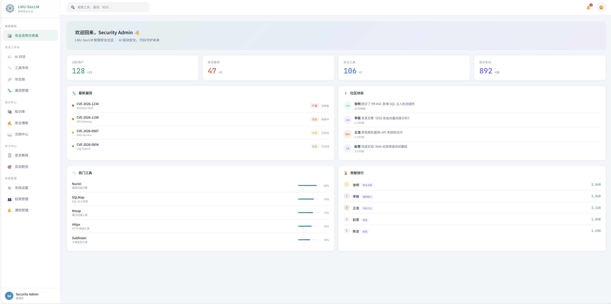

*仪表盘提供系统运行状态、安全漏洞、工具使用情况和知识库的全面概览,帮助用户快速了解平台核心功能和当前状态。*

### 核心功能概览

<table>
<tr>
<td width="33.33%" align="center">
<strong>Web 控制台</strong><br/>
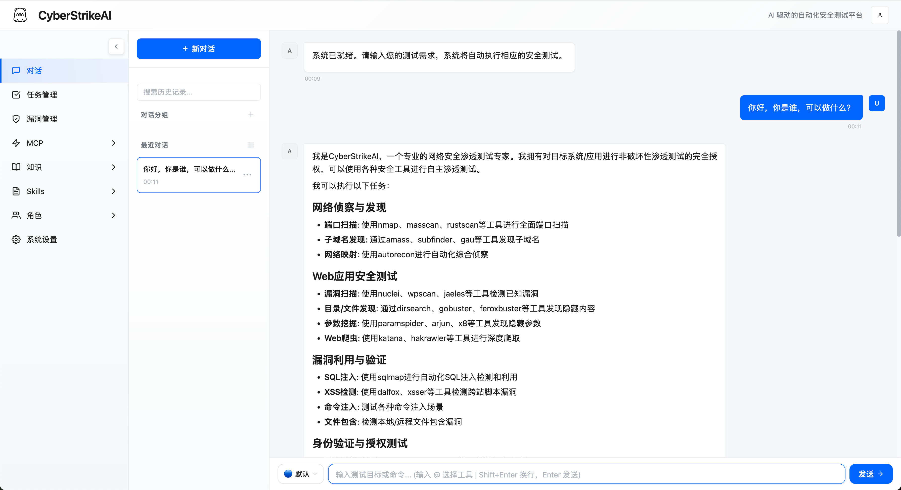
</td>
<td width="33.33%" align="center">
<strong>任务管理</strong><br/>
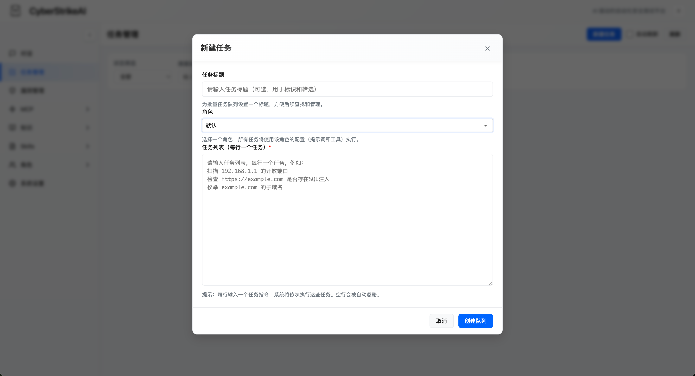
</td>
<td width="33.33%" align="center">
<strong>漏洞管理</strong><br/>
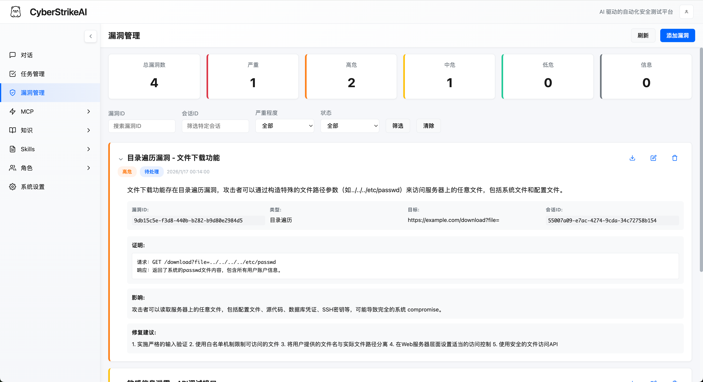
</td>
</tr>
<tr>
<td width="33.33%" align="center">
<strong>WebShell 管理</strong><br/>
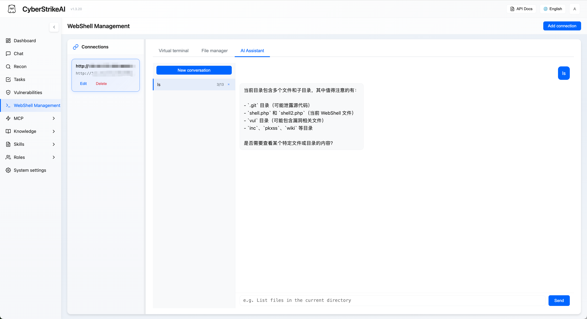
</td>
<td width="33.33%" align="center">
<strong>MCP 管理</strong><br/>
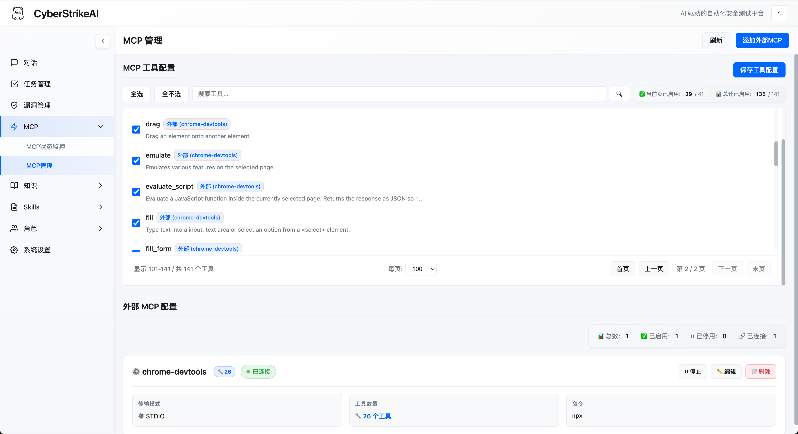
</td>
<td width="33.33%" align="center">
<strong>知识库</strong><br/>
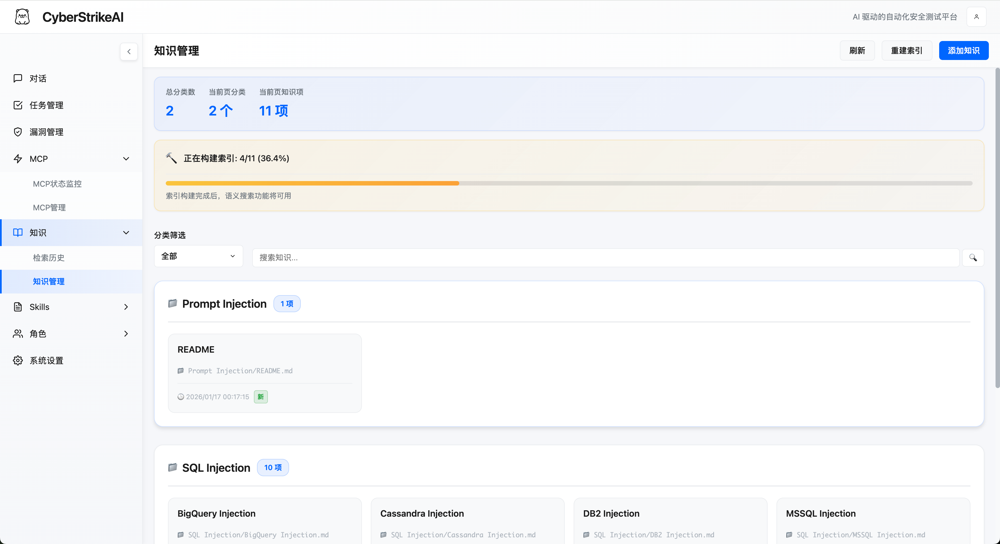
</td>
</tr>
<tr>
<td width="33.33%" align="center">
<strong>Skills 管理</strong><br/>
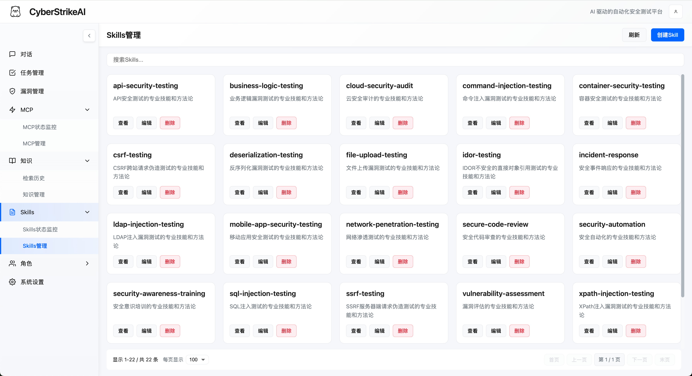
</td>
<td width="33.33%" align="center">
<strong>Agent 管理</strong><br/>
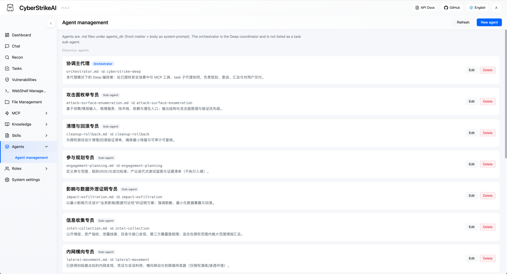
</td>
<td width="33.33%" align="center">
<strong>角色管理</strong><br/>
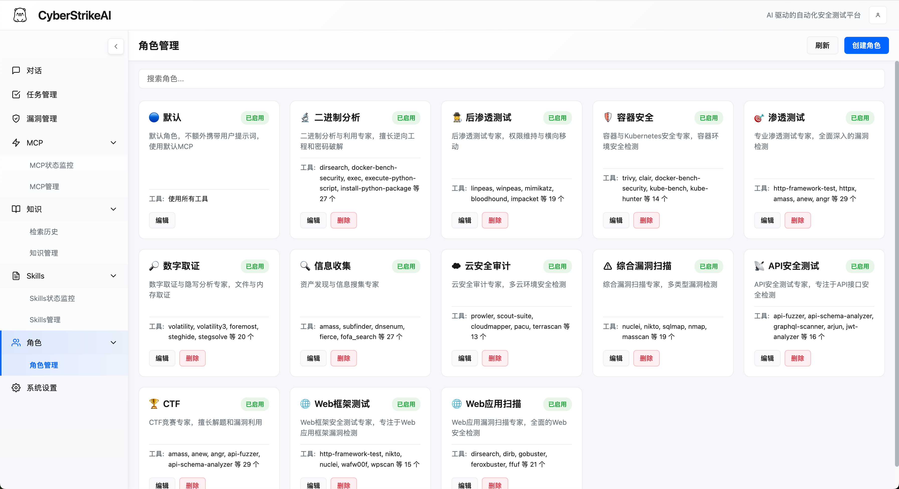
</td>
</tr>
<tr>
<td width="33.33%" align="center">
<strong>系统设置</strong><br/>
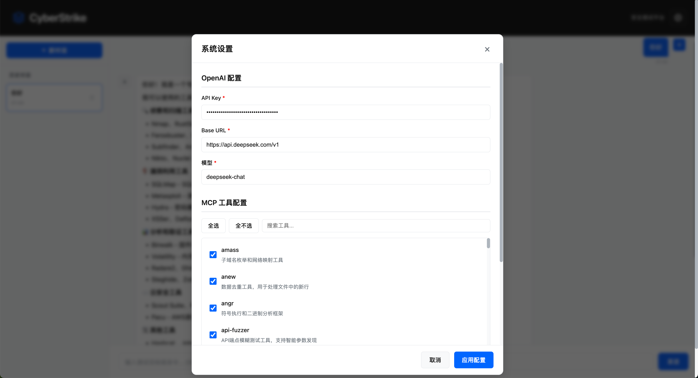
</td>
<td width="33.33%" align="center">
<strong>MCP stdio 模式</strong><br/>
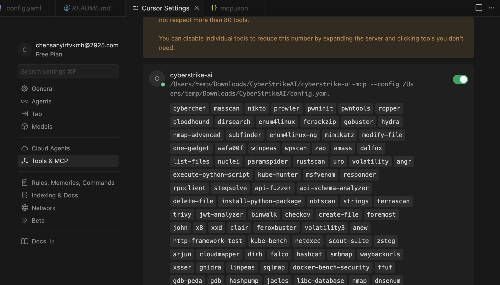
</td>
<td width="33.33%" align="center">
<strong>Burp Suite 插件</strong><br/>
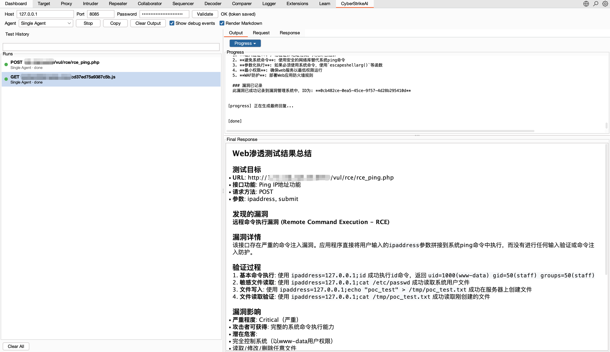
</td>
</tr>
</table>

</div>

## 特性速览

- 🤖 兼容 OpenAI/DeepSeek/Claude 等模型的智能决策引擎
- 🔌 原生 MCP 协议,支持 HTTP / stdio / SSE 传输模式以及外部 MCP 接入
- 🧰 100+ 现成工具模版 + YAML 扩展能力
- 📄 大结果分页、压缩与全文检索
- 🔗 攻击链可视化、风险打分与步骤回放
- 🔒 Web 登录保护、审计日志、SQLite 持久化
- 📚 知识库功能:向量检索与混合搜索,为 AI 提供安全专业知识
- 📁 对话分组管理:支持分组创建、置顶、重命名、删除等操作
- 🛡️ 漏洞管理功能:完整的漏洞 CRUD 操作,支持严重程度分级、状态流转、按对话/严重程度/状态过滤,以及统计看板
- 📋 批量任务管理:创建任务队列,批量添加任务,依次顺序执行,支持任务编辑与状态跟踪
- 🎭 角色化测试:预设安全测试角色(渗透测试、CTF、Web 应用扫描等),支持自定义提示词和工具限制
- 🧩 **多代理模式(Eino DeepAgent)**:可选编排——协调主代理通过 `task` 调度 Markdown 定义的子代理;主代理见 `agents/orchestrator.md` 或 front matter `kind: orchestrator`,子代理为 `agents/*.md`;开启 `multi_agent.enabled` 后聊天可切换单代理/多代理(详见 [多代理说明](docs/MULTI_AGENT_EINO.md))
- 🎯 Skills 技能系统:20+ 预设安全测试技能(SQL 注入、XSS、API 安全等),可附加到角色或由 AI 按需调用
- 📱 **机器人**:支持钉钉、飞书长连接,在手机端与 LNU-SecLM 对话(配置与命令详见 [机器人使用说明](docs/robot.md))
- 🐚 **WebShell 管理**:添加与管理 WebShell 连接(兼容冰蝎/蚁剑等),通过虚拟终端执行命令、内置文件管理进行文件操作,并提供按连接维度保存历史的 AI 助手标签页;支持 PHP/ASP/ASPX/JSP 及自定义类型,可配置请求方法与命令参数
- 🎓 **学习中心(开发中)**:面向辽大师生的安全教程与实验靶场,适配课堂教学与新生入门训练
- 📰 **社区互动(开发中)**:贡献排行榜、社区动态 Feed、积分等级体系
- 🏛️ **届次传承机制**:制度化保证项目跨届持续演进

## 插件(Plugins)

可选集成在 `plugins/` 目录下。

- **Burp Suite 插件**:`plugins/burp-suite/lnu-seclm-burp-extension/`
  构建产物:`plugins/burp-suite/lnu-seclm-burp-extension/dist/lnu-seclm-burp-extension.jar`
  说明文档:`plugins/burp-suite/lnu-seclm-burp-extension/README.zh-CN.md`

## 工具概览

系统预置 100+ 渗透/攻防工具,覆盖完整攻击链:

- **网络扫描**:nmap、masscan、rustscan、arp-scan、nbtscan
- **Web 应用扫描**:sqlmap、nikto、dirb、gobuster、feroxbuster、ffuf、httpx
- **漏洞扫描**:nuclei、wpscan、wafw00f、dalfox、xsser
- **子域名枚举**:subfinder、amass、findomain、dnsenum、fierce
- **网络空间搜索引擎**:fofa_search、zoomeye_search
- **API 安全**:graphql-scanner、arjun、api-fuzzer、api-schema-analyzer
- **容器安全**:trivy、clair、docker-bench-security、kube-bench、kube-hunter
- **云安全**:prowler、scout-suite、cloudmapper、pacu、terrascan、checkov
- **二进制分析**:gdb、radare2、ghidra、objdump、strings、binwalk
- **漏洞利用**:metasploit、msfvenom、pwntools、ropper、ropgadget
- **密码破解**:hashcat、john、hashpump
- **取证分析**:volatility、volatility3、foremost、steghide、exiftool
- **后渗透**:linpeas、winpeas、mimikatz、bloodhound、impacket、responder
- **CTF 实用工具**:stegsolve、zsteg、hash-identifier、fcrackzip、pdfcrack、cyberchef
- **系统辅助**:exec、create-file、delete-file、list-files、modify-file

## 基础使用

### 快速上手(一条命令部署)

**环境要求:**
- Go 1.21+ ([下载安装](https://go.dev/dl/))
- Python 3.10+ ([下载安装](https://www.python.org/downloads/))

**一条命令部署:**
```bash
git clone https://github.com/LNU-SecLM/LNU-SecLM.git
cd LNU-SecLM
chmod +x run.sh && ./run.sh
```

`run.sh` 脚本会自动完成:
- ✅ 检查并验证 Go 和 Python 环境
- ✅ 创建 Python 虚拟环境
- ✅ 安装 Python 依赖包
- ✅ 下载 Go 依赖模块
- ✅ 编译构建项目
- ✅ 启动服务器

**首次配置:**
1. **配置 AI 模型 API**(首次使用前必填)
   - 启动后访问 http://localhost:8080
   - 进入 `设置` → 填写 API 配置信息:
     ```yaml
     openai:
       api_key: "sk-your-key"
       base_url: "https://api.openai.com/v1"  # 或 https://api.deepseek.com/v1
       model: "gpt-4o"  # 或 deepseek-chat、claude-3-opus 等
     ```
   - 或启动前直接编辑 `config.yaml` 文件
2. **登录系统** - 使用控制台显示的自动生成密码(或在 `config.yaml` 中设置 `auth.password`)
3. **安装安全工具(可选)** - 按需安装所需工具:
   ```bash
   # macOS
   brew install nmap sqlmap nuclei httpx gobuster feroxbuster subfinder amass
   # Ubuntu/Debian
   sudo apt-get install nmap sqlmap nuclei httpx gobuster feroxbuster
   ```
   未安装的工具会自动跳过或改用替代方案。

**其他启动方式:**
```bash
# 直接运行(需手动配置环境)
go run cmd/server/main.go

# 手动编译
go build -o lnu-seclm cmd/server/main.go
./lnu-seclm
```

**说明:** Python 虚拟环境(`venv/`)由 `run.sh` 自动创建和管理。需要 Python 的工具(如 `api-fuzzer`、`http-framework-test` 等)会自动使用该环境。

### LNU-SecLM 版本更新(无兼容性问题)

1. (首次使用)启用脚本:`chmod +x upgrade.sh`
2. 一键升级:`./upgrade.sh`(可选参数:`--tag vX.Y.Z`、`--no-venv`、`--preserve-custom`、`--yes`)
3. 脚本会备份你的 `config.yaml` 和 `data/`,从 GitHub Release 升级代码,更新 `config.yaml` 的 `version` 字段后重启服务。

推荐的一键指令:
`chmod +x upgrade.sh && ./upgrade.sh --yes`

如果升级失败,可以从 `.upgrade-backup/` 恢复,或按旧方式手动拷贝 `/data` 和 `config.yaml` 后再运行 `./run.sh`。

依赖/提示:
* 需要 `curl` 或 `wget` 用于下载 GitHub Release 包。
* 建议/需要 `rsync` 用于安全同步代码。
* 如果遇到 GitHub API 限流,运行前设置 `export GITHUB_TOKEN="..."` 再执行 `./upgrade.sh`。

⚠️ **注意:** 仅适用于无兼容性变更的版本更新。若版本存在兼容性调整,此方法不适用。

**举例:** 无兼容性变更如 v1.3.1 → v1.3.2;有兼容性变更如 v1.3.1 → v1.4.0。项目采用语义化版本(SemVer):仅第三位(补丁号)变更时通常可安全按上述步骤升级;次版本号或主版本号变更时可能涉及配置、数据或接口调整,需查阅 release notes 再决定是否适用本方法。

### 常用流程
- **对话测试**:自然语言触发多步工具编排,SSE 实时输出。
- **单代理 / 多代理**:配置 `multi_agent.enabled: true` 后,聊天界面可切换 **单代理**(原有 ReAct 循环)与 **多代理**(Eino DeepAgent + `task` 子代理)。多代理走 `/api/multi-agent/stream`,MCP 工具与单代理同源桥接。
- **角色化测试**:从预设的安全测试角色(渗透测试、CTF、Web 应用扫描、API 安全测试等)中选择,自定义 AI 行为和可用工具。每个角色可应用自定义系统提示词,并可限制可用工具列表,实现聚焦的测试场景。
- **工具监控**:查看任务队列、执行日志、大文件附件。
- **会话历史**:所有对话与工具调用保存在 SQLite,可随时重放。
- **对话分组**:将对话按项目或主题组织到不同分组,支持置顶、重命名、删除等操作,所有数据持久化存储。
- **漏洞管理**:在测试过程中创建、更新和跟踪发现的漏洞。支持按严重程度(严重/高/中/低/信息)、状态(待确认/已确认/已修复/误报)和对话进行过滤,查看统计信息并导出发现。
- **批量任务管理**:创建任务队列,批量添加多个任务,执行前可编辑或删除任务,然后依次顺序执行。每个任务会作为独立对话执行,支持完整的状态跟踪(待执行/执行中/已完成/失败/已取消)和执行历史。
- **WebShell 管理**:添加并管理 WebShell 连接(PHP/ASP/ASPX/JSP 或自定义类型)。使用虚拟终端执行命令(带命令历史与快捷命令),使用文件管理浏览、读取、编辑、上传与删除目标文件,并支持按路径导航和名称过滤。连接信息持久化存储于 SQLite,支持 GET/POST 及可配置命令参数(兼容冰蝎/蚁剑等)。
- **可视化配置**:在界面中切换模型、启停工具、设置迭代次数等。

### 默认安全措施
- 设置面板内置必填校验,防止漏配 API Key/Base URL/模型。
- `auth.password` 为空时自动生成 24 位强口令并写回 `config.yaml`。
- 所有 API(除登录外)都需携带 Bearer Token,统一鉴权中间件拦截。
- 每个工具执行都带有超时、日志和错误隔离。

## 进阶使用

### 角色化测试
- **预设角色**:系统内置 12+ 个预设的安全测试角色(渗透测试、CTF、Web 应用扫描、API 安全测试、二进制分析、云安全审计等),位于 `roles/` 目录。
- **自定义提示词**:每个角色可定义 `user_prompt`,会在用户消息前自动添加,引导 AI 采用特定的测试方法和关注重点。
- **工具限制**:角色可指定 `tools` 列表,限制可用工具,实现聚焦的测试流程(如 CTF 角色限制为 CTF 专用工具)。
- **Skills 集成**:角色可附加安全测试技能。技能名称会作为提示添加到系统提示词中,AI 智能体可通过 `read_skill` 工具按需获取技能内容。
- **轻松创建角色**:通过在 `roles/` 目录添加 YAML 文件即可创建自定义角色。每个角色定义 `name`、`description`、`user_prompt`、`icon`、`tools`、`skills`、`enabled` 字段。
- **Web 界面集成**:在聊天界面通过下拉菜单选择角色。角色选择会影响 AI 行为和可用工具建议。

**创建自定义角色示例:**
1. 在 `roles/` 目录创建 YAML 文件(如 `roles/custom-role.yaml`):
   ```yaml
   name: 自定义角色
   description: 专用测试场景
   user_prompt: 你是一个专注于 API 安全的专业安全测试人员...
   icon: "\U0001F4E1"
   tools:
     - api-fuzzer
     - arjun
     - graphql-scanner
   skills:
     - api-security-testing
     - sql-injection-testing
   enabled: true
   ```
2. 重启服务,新角色立即可用。

### Skills 技能系统
- **预设技能**:20+ 安全测试技能(SQL 注入、XSS、文件上传、API 安全、业务逻辑测试等)。
- **按需调用**:Skills 内容不会自动注入提示词,AI 通过 `read_skill` 工具按需读取,节省 Token。
- **创建自定义 Skill**:
  1. 在 `skills/` 目录创建目录(如 `skills/my-skill/`)
  2. 在该目录下创建 `SKILL.md` 文件,编写技能内容
  3. 在角色的 YAML 文件中,通过添加 `skills` 字段将该技能附加到角色

### 工具编排与扩展
- `tools/*.yaml` 定义命令、参数、提示词与元数据,可热加载。
- `security.tools_dir` 指向目录即可批量启用;仍支持在主配置里内联定义。
- **大结果分页**:超过 200KB 的输出会保存为附件,可通过 `query_execution_result` 工具分页、过滤、正则检索。
- **结果压缩/摘要**:多兆字节日志可先压缩或生成摘要再写入 SQLite,减小档案体积。

**自定义工具的一般步骤**
1. 复制 `tools/` 下现有示例(如 `tools/sample.yaml`)。
2. 修改 `name`、`command`、`args`、`short_description` 等基础信息。
3. 在 `parameters[]` 中声明位置参数或带 flag 的参数,方便智能体自动拼装命令。
4. 视需要补充 `description` 或 `notes`,给 AI 额外上下文或结果解读提示。
5. 重启服务或在界面中重新加载配置,新工具即可在 Settings 面板中启用/禁用。

### 攻击链分析
- 智能体解析每次对话,抽取目标、工具、漏洞与因果关系。
- Web 端可交互式查看链路节点、风险级别及时间轴,支持导出报告。

### WebShell 管理
- **连接管理**:在 Web 界面进入 **WebShell 管理**,可添加、编辑或删除 WebShell 连接。每条连接包含:Shell 地址、密码/密钥、Shell 类型(PHP/ASP/ASPX/JSP/自定义)、请求方式(GET/POST)、命令参数名(默认 `cmd`)、备注等信息,并持久化存储在 SQLite,兼容冰蝎、蚁剑等常见客户端。
- **虚拟终端**:选择连接后,在 **虚拟终端** 标签页中执行任意命令,支持命令历史与常用快捷命令(whoami/id/ls/pwd 等),输出在浏览器中实时显示,支持 Ctrl+L 清屏。
- **文件管理**:在 **文件管理** 标签页中可列出目录、读取/编辑文件、删除文件、新建文件/目录、上传文件(大文件分片上传)、重命名路径以及下载勾选文件,并支持面包屑导航与名称过滤。
- **AI 助手**:在 **AI 助手** 标签页中与智能体对话,由系统自动结合当前 WebShell 连接执行工具与命令,侧边栏展示该连接下的所有历史会话,支持多轮追踪与查看。
- **连通性测试**:使用 **测试连通性** 可在执行命令前通过一次 `echo 1` 调用校验 Shell 地址、密码与命令参数是否正确。
- **持久化**:所有 WebShell 连接与相关 AI 会话均保存在 SQLite(与对话共用数据库),服务重启后仍可继续使用。

### MCP 全场景
- **Web 模式**:自带 HTTP MCP 服务供前端调用。
- **MCP stdio 模式**:`go run cmd/mcp-stdio/main.go` 可接入 Cursor/命令行。
- **外部 MCP 联邦**:在设置中注册第三方 MCP(HTTP/stdio/SSE),按需启停并实时查看调用统计与健康度。
- **可选 MCP 服务**:项目中的 [`mcp-servers/`](mcp-servers/README_CN.md) 目录提供独立 MCP(如反向 Shell),采用标准 MCP stdio,可在 LNU-SecLM(设置 → 外部 MCP)、Cursor、VS Code 等任意支持 MCP 的客户端中使用。

#### MCP stdio 快速集成
1. **编译可执行文件**(在项目根目录执行):
   ```bash
   go build -o lnu-seclm-mcp cmd/mcp-stdio/main.go
   ```
2. **在 Cursor 中配置**
   打开 `Settings → Tools & MCP → Add Custom MCP`,选择 **Command**,指定编译后的程序与配置文件:
   ```json
   {
     "mcpServers": {
       "lnu-seclm": {
         "command": "/absolute/path/to/lnu-seclm-mcp",
         "args": [
           "--config",
           "/absolute/path/to/config.yaml"
         ]
       }
     }
   }
   ```
   将路径替换成你本地的实际地址,Cursor 会自动启动 stdio 版本的 MCP。

#### MCP HTTP 快速集成(Cursor / Claude Code)
HTTP MCP 服务在独立端口(默认 `8081`)运行,支持 **Header 鉴权**:仅携带正确 header 的客户端可调用工具。

1. **在配置中启用 MCP** – 在 `config.yaml` 中设置 `mcp.enabled: true`,并按需设置 `mcp.host` / `mcp.port`。若需鉴权(端口对外暴露时建议开启),可设置:
   - `mcp.auth_header`:鉴权用的 header 名(如 `X-MCP-Token`);
   - `mcp.auth_header_value`:鉴权密钥。**留空**时,首次启动会自动生成随机密钥并写回配置文件。
2. **启动服务** – 执行 `./run.sh` 或 `go run cmd/server/main.go`。MCP 端点为 `http://<host>:<port>/mcp`(例如 `http://localhost:8081/mcp`)。
3. **从终端复制 JSON** – 启用 MCP 后,启动时会在终端打印一段 **可直接复制的 JSON**。若 `auth_header_value` 留空,会自动生成并写入配置,打印内容中会包含 URL 与 headers。

### 知识库系统
- **预构建知识库下载**:可从 [Releases](https://github.com/LNU-SecLM/LNU-SecLM/releases) 下载预构建的知识数据库直接使用,无需手动构建索引。
- **配置启用**:在 `config.yaml` 中设置 `knowledge.enabled: true`,配置嵌入模型(支持 OpenAI、阿里云通义等)。
- **添加知识文件**:将 Markdown 文件放入 `knowledge_base/` 目录,按分类组织(如 `knowledge_base/SQL注入/README.md`)。
- **扫描索引**:在 Web 界面中点击"扫描知识库",系统会自动导入文件并构建向量索引。
- **对话中使用**:AI 智能体在需要安全知识时会自动调用知识检索工具,也可显式要求"搜索知识库中关于 SQL 注入的技术"。

### 自动化与安全
- **REST API**:认证、会话、任务、监控、漏洞管理、角色管理等接口全部开放,可与 CI/CD 集成。
- **多代理 API**:`POST /api/multi-agent/stream`(SSE,需启用多代理)、`POST /api/multi-agent`(非流式);Markdown 子代理/主代理管理见 `/api/multi-agent/markdown-agents`(列表/读写/增删)。
- **角色管理 API**:通过 `/api/roles` 端点管理安全测试角色:`GET /api/roles`(列表)、`GET /api/roles/:name`(获取)、`POST /api/roles`(创建)、`PUT /api/roles/:name`(更新)、`DELETE /api/roles/:name`(删除)。角色以 YAML 文件形式存储在 `roles/` 目录,支持热加载。
- **漏洞管理 API**:通过 `/api/vulnerabilities` 端点管理漏洞:`GET /api/vulnerabilities`(列表)、`POST /api/vulnerabilities`(创建)、`GET /api/vulnerabilities/:id`(获取)、`PUT /api/vulnerabilities/:id`(更新)、`DELETE /api/vulnerabilities/:id`(删除)、`GET /api/vulnerabilities/stats`(统计)。
- **批量任务 API**:通过 `/api/batch-tasks` 端点管理批量任务队列。
- **WebShell API**:通过 `/api/webshell/connections` 及 `/api/webshell/exec`、`/api/webshell/fileop` 管理 WebShell 连接与执行操作。
- **任务控制**:支持暂停/终止长任务、修改参数后重跑、流式获取日志。
- **安全管理**:`/api/auth/change-password` 可即时轮换口令;建议在暴露 MCP 端口时配合网络层 ACL。

## 相关文档

- [多代理模式(Eino)](docs/MULTI_AGENT_EINO.md):DeepAgent 编排、`agents/*.md`、接口与流式说明。
- [机器人使用说明(钉钉 / 飞书)](docs/robot.md):在手机端通过钉钉、飞书与 LNU-SecLM 对话的完整配置步骤、命令与排查说明,**建议按该文档操作以避免走弯路**。
- [前端国际化方案](docs/frontend-i18n.md):前端 i18n 设计与开发规范。
- [架构设计文档模板](docs/架构设计文档模板.md):新模块/新项目的架构文档模板。
- [贡献指南](docs/contribution.md):代码规范、提交流程、PR 模板。

## 项目结构

```
LNU-SecLM/
├── cmd/                 # Web 服务、MCP stdio 入口及辅助工具
├── internal/            # Agent、MCP 核心、路由与执行器
├── web/                 # 前端静态资源与模板
├── tools/               # YAML 工具目录(含 100+ 示例)
├── roles/               # 角色配置文件目录(含 12+ 预设安全测试角色)
├── skills/              # Skills 目录(含 20+ 预设安全测试技能)
├── agents/              # 多代理 Markdown(orchestrator.md + 子代理 *.md)
├── knowledge_base/      # 知识库内容(Markdown)
├── docs/                # 说明文档
├── images/              # 文档配图
├── tutorial/            # 教学/实训模块教程(LNU-SecLM 新增)
├── config.yaml          # 运行配置
├── run.sh               # 启动脚本
└── README*.md
```

## 基础体验示例

```
扫描 192.168.1.1 的开放端口
对 192.168.1.1 做 80/443/22 重点扫描
检查 https://example.com/page?id=1 是否存在 SQL 注入
枚举 https://example.com 的隐藏目录与组件漏洞
获取 example.com 的子域并批量执行 nuclei
```

## 进阶剧本示例

```
加载侦察剧本:先 amass/subfinder,再对存活主机进行目录爆破。
挂载基于 Burp 的外部 MCP,完成认证流量回放并回传到攻击链。
将 5MB nuclei 报告压缩并生成摘要,附加到对话记录。
构建最新一次测试的攻击链,只导出风险 >= 高的节点列表。
```

## 开发路线图

社区建设按五个阶段稳步推进:

| 阶段 | 目标 |
|------|------|
| **一 · 筹备** | 完成社区章程制定、文档模板标准化、GitHub 组织架构搭建 |
| **二 · 项目开发** | 上线项目广场与用户认证,完成试点项目的接入测试 |
| **三 · 核心上线** | 发布 AI 助手、工具市场及文档系统,完善社区核心生态能力 |
| **四 · 运营启动** | 举办线上分享会,启动新成员招募计划 |
| **五 · 规模化** | 接入外部项目,拓展对外合作渠道,实现社区规模增长 |

### 三年愿景

| 时间 | 里程碑 |
|------|--------|
| **2026 · 校内标杆** | 完成基础建设,树立校内影响力 |
| **2027 · 规模扩展** | 成功举办首届安全技术峰会 |
| **2028 · 国内知名** | 与 10+ 高校建立深度合作关系 |

### 第一年核心指标(2026)

- **20+** 孵化活跃项目
- **200+** 注册用户规模
- **20+** 培养核心贡献者
- **100+** 产出技术文档
- **1k+** GitHub Stars

## 社区治理

### 组织架构
构建 **"指导 - 决策 - 执行"** 三级联动体系:

- **顶层 · 指导教师组**:战略方向把控、核心资源对接、学术指导
- **中层 · 社区委员会(学生代表)**:日常事务决策、项目合规审查、跨组协调
- **底层 · 三大执行小组**
  - 平台开发组:社区技术基建与迭代
  - 项目孵化组:推动安全项目落地与实战
  - 社区运营组:文档沉淀、活动策划与推广

### 项目接入流程
```
01 申请提交 → 02 初步审查 → 03 技术评审 → 04 正式接入
```

### 文档三大核心规则
1. **标准化 README** —— 所有项目必须具备标准化文档,无 README 的项目严禁接入社区
2. **同步更新机制** —— 功能变更 PR 必须同步更新文档,文档未更新则 PR 不予合并
3. **结课交接文档** —— 结课前必须完成标准交接文档,制度层面杜绝"人走茶凉"

### 贡献者激励机制
- **量化贡献价值**:代码、Bug 修复、文档、技术分享均数字化为可累积积分
- **等级荣誉晋升**:积分提升社区等级,解锁勋章与荣誉头衔
- **多元奖励回馈**:定制周边、机械键盘、实习内推、会议差旅支持、荣誉证书

详细治理规则与贡献指南见 [docs/contribution.md](docs/contribution.md)。

---

## 许可证与致谢

### 开源许可

LNU-SecLM 采用 **Apache License 2.0** 开源许可。
完整条款见仓库根目录 [LICENSE](LICENSE) 文件。

### 上游致谢

LNU-SecLM 基于 [CyberStrikeAI](https://github.com/Ed1s0nZ/CyberStrikeAI)(Apache 2.0)进行二次定制开发。感谢原项目作者 [@Ed1s0nZ](https://github.com/Ed1s0nZ) 及所有贡献者的开源工作 —— 没有 CyberStrikeAI 的优秀基础架构,就不会有 LNU-SecLM 的快速起步。

---

## ⚠️ 免责声明

**本平台仅供教育和授权测试使用!**

LNU-SecLM 是辽宁大学校园教学与研究平台,旨在帮助师生在 **获得明确授权** 的前提下进行安全学习、研究、漏洞研究与评估。

**使用本平台即表示您同意:**
- 仅在您拥有明确书面授权的系统上使用此平台
- 遵守国家法律法规、学校规章制度及道德准则
- 对任何未经授权的使用或滥用行为承担全部责任
- 不会将本平台用于任何非法或恶意目的

**任何滥用行为由使用者自行承担责任,与开发团队及辽宁大学无关!** 请确保您的使用符合当地法律法规,并获得目标系统所有者的明确授权。

---

欢迎提交 Issue/PR 贡献新的工具模版、教学内容或功能优化建议!

<div align="center">
  <sub>Built with ❤️ by LNU-SecLM Community · 辽宁大学开源安全社区</sub>
</div>
